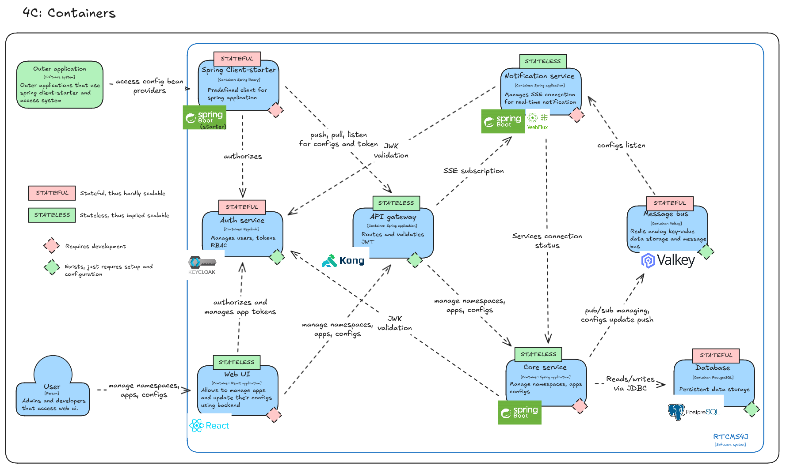

# HSE diploma project repository

## About project

Project name: `Realtime Configurations Managing System for Spring Boot Microservices`

Project info: `Higher School of Economics, Software Engeeneering, Bachelor diploma`

Author: `Shamaev Onar Evgenevich (BPI227)`

## Project architecture

