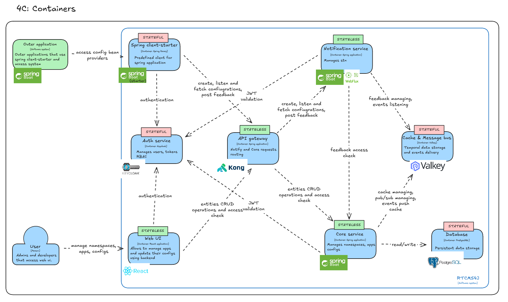

# HSE diploma project repository

## About project

Project name: `Realtime Configurations Managing System for Spring Boot Microservices`

Project info: `Higher School of Economics, Software Engeeneering, Bachelor diploma`

Author: `Shamaev Onar Evgenevich (BPI227)`

## Description

Project is a software system, that allows microservice application to define their configurations (DTOs),
push their schemas to RTCMS4J backend and allow developers to update configurations' values via web UI.
In terms of this bachelor project, it is planned to focus on Spring Boot microservice applications and
thus develop pre-defined rtcms4j-client-starter.

## Project architecture



## Usage

### Setting Up the System

To set up the RTCMS4J system, please follow the instructions in the `rtcms4j-env` repository's `/docker` folder. It contains the necessary `docker-compose` configuration to deploy the RTCMS4J backend.

Repository: [rtcms4j-env](https://github.com/hse-rtcms4j/rtcms4j-env)

### Adding Dependency to Your Spring Boot Project

To integrate RTCMS4J into your Spring Boot microservice application, you need to add the `rtcms4j-spring-client-starter` dependency to your `pom.xml` or `build.gradle` file. The current relevant version is `0.1.3`.

#### Maven

Add the following dependency in your `pom.xml`:

```xml
<dependency>
    <groupId>ru.enzhine</groupId>
    <artifactId>rtcms4j-spring-client-starter</artifactId>
    <version>{version}</version>
</dependency>
````

#### Gradle

Add the following dependency in your `build.gradle`:

```gradle
dependencies {
    implementation 'ru.enzhine:rtcms4j-spring-client-starter:{version}'
}
```

#### Gradle Kotlin DSL

For projects using Gradle Kotlin DSL (`build.gradle.kts`), add the following dependency:

```kotlin
dependencies {
    implementation("ru.enzhine:rtcms4j-spring-client-starter:{version}")
}
```

Replace `{version}` with `0.1.3` for the current release.

### Application Properties

Once the dependency is added, configure your `application.yml` file as follows:

```yaml
spring:
  rtcms4j:
    # Enable or disable the library
    enabled: true
    # The RTCMS4J namespace ID for your application
    namespace-id: 1
    # The RTCMS4J application ID associated with your project
    application-id: 2
    api:
      # RTCMS4J core API gateway URL
      core-base-url: http://localhost:8000/core/api/v1
      # RTCMS4J notify API gateway URL
      notify-base-url: http://localhost:8000/notify/api/v1
    # Token refresh offset (prevents token expiration)
    token-refresh-offset: 10m
    keycloak:
      # Keycloak server URL used by RTCMS4J
      server-url: http://localhost:8080
      # Client ID for RTCMS4J application
      client-id: ns1_app2
      # Client secret for RTCMS4J application
      client-secret: o47FZ2ZfRVhCWS7OQUl3I3O6zvAX4g5b
    maintain:
      # Configuration relevance maintenance strategy
      type: stream
```

### For Detailed Configuration

For more detailed configuration and advanced options, check out the `rtcms4j-spring` repository:

[rtcms4j-spring GitHub](https://github.com/hse-rtcms4j/rtcms4j-spring)
